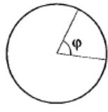
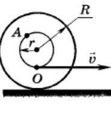

$$
\operatorname* {4 A C T b} 2 
$$

В1  За промежуток времени $\Delta t=\mathbf{1 0}$ с тело прошло половину окружности радиусом $R={\bf1 0 0}$ см. Найдите модуль вектора средней скорости:

В2 | Длина минутной стрелки наручных часов $R=5$ мм. какой скоростью перемещается конец стрелки?

В3] $= 2 7, 3$ Сут:   Средний   радиус   орбиты   Луны $\begin{array} {c} {T \ =} \\ {R \ \ =} \end{array}$ 
движется   вокруг   Земли периодом
 $= 3, 8 \cdot1 0^{5}$ км. Найдите ее нормальное ускорение

В4 | искусственный   спутник   равномерно   движется   по круговой орбите с периодом ч, при этом ускорение спутника а = 0,46 м/с2 . делите радиус орби-ты (в км)

85  Машина со скоростью $v=3 6$ кусо въезжаен анаяа=
на кругленный участок шоссе радиусом $R={\bf1 0 0}$ м и начинает тормозить с ускорением $a=0, 3 \ \mathtt{M} / \mathrm{c}^{2}$ 
центростремительное ускорение через $t_{1}=2 0$ с после начала торможения:

В6 ] Овтределетосятеремеовейиекоаостмин 0 зелосиседиста; движущегося с угловой скоростью 0,1 рад/с
ружности радиусом 60 м.

87 |Ось с двумя дисками , расположенными на расстоянии $l=0, 5$ м друг от друга, вращается $\mathbf{c}$  частотой $n=1 6 0 0$ об/мин: Пуля, летящая вдоль оси, пробивает оба диска, причем отверстие от пули во вто-рорстдяскаервеменоготносительно  от-верстия в первом на угол $\varphi={\bf1 2^{\circ} \, ( p a c. \ 4 ).}$ Найдите скорость пули.

Рис. 4

В8 | Катушка с намотанной на нее нитью (орсзонтаттся беоскольжёниюда ря   вытягиванию   нити горизон-ввеыновй новеахлоснеи соатуовсетоо $\upsilon~=~ 2 \, {\bf M} / {\bf c}$ оотадвнусчейнитре $R=2$ м. отеетсевеновеавностей катушки со-
 $r=1$ 
Найдите скорость точки $A$ отпоси-тельно земли:

$$
\mathbf{P u c.} \ 5 
$$

