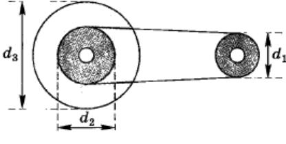

## ЧАСТЬ 3

61 [исколярная освилальмееасажкемепркив  диаметром
пила   имеет   диаметр $d_{3} \ =\ 4 0 0$ (рис: 6).
" $d_{2}=\mathbf{\partial} 2 \mathbf{0} \mathbf{0}$ ммеметооый ереиаодитсяпвсиврадуемером
во вращение
" м ременной   передачи
 $d_{1}={\bf1 1 0}$ мм, насаженного на вал элсктродвигателя: Какова скорость пилы, если вал двигателя совершает $n=1 2 0 0$ об/мин?

$$
\mathbf{P_{H} c. \, 6} 
$$

С2 | Диск радиусом $R=2 0$ см приводится во вращение ги-рей, подвешенной на нити, которая постепенно сма-нием $a=0, 0 8 \ \mathrm{M} / \mathrm{c}^{2}$ 'Жемуравнстенуроетреясускьрое тывмется сдиска.  Чемуараваецонтсостьсмстскьрсе ускорение $a_{1}$ верхней точки диска в тот момент, когда гиря пройдет путь $s=1$ м?

СЗ | Автомобиль с колесами радиусом $R=3 0$ см движется без проскальзывания по горизонтальной дороге со скоростью $v=3 6$ км/ч. На какую максимальную высоту над поверхностью земли поднимаются капли грязи; отрывающиеся от колес?

Маштч пъчва ~тазъа    ^КпаэтаптИ ПрЯМОЙ УГОЛ,
линой $L_{0}={\bf1}$ 

ш€лду дэумл ~€ппамк, чраэутлщш движется без отрыва стержень $A B$ д) точки $M$ (рис. 7). Скорость точки $B$ допожюе и равна $\upsilon_{0}=0, 0 2 \mathrm{~ M} / \mathrm{~ \Omega~}$ (еяеняоржоре
ризонтально: Определите скорость
>   расположенпой
стоянии $M B=L=5 0$ см от точки $B$ ' в момент времени, когда угол между гс $R$ хгтявп яет $\boldsymbol{\alpha}=\boldsymbol{6} \boldsymbol{0}^{\circ}$ 
изонтальной стенкой и стержнем

11 ~-чъ- Рис. 7